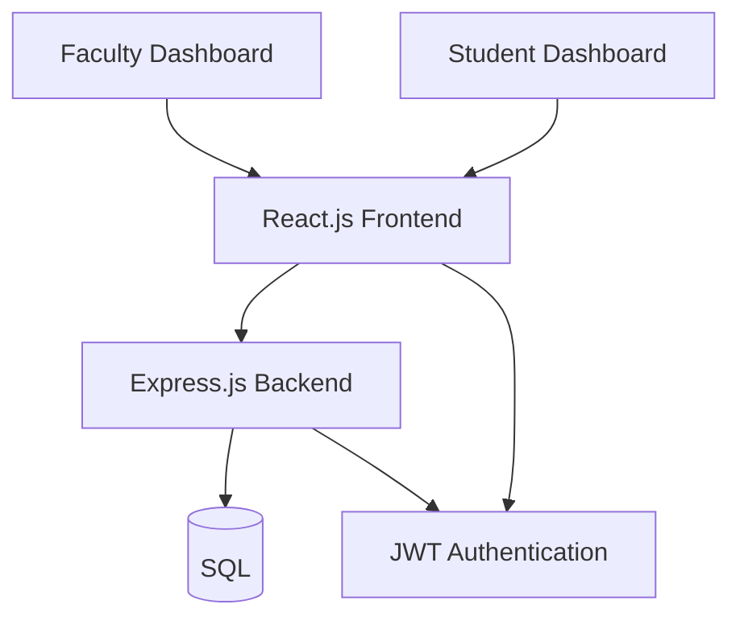
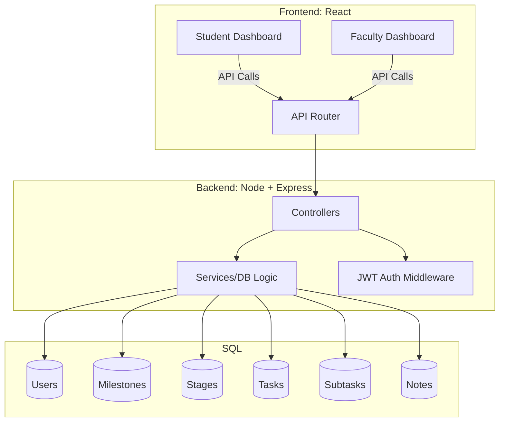

# 📚 ResearchNest – MERN Dashboard

## 🚀 Overview

ResearchNest is a full-stack MERN application designed to track academic progress through **Milestones → Stages → Tasks → Subtasks**.

It includes separate dashboards for:

- **Students**: manage tasks/subtasks, view notes, track progress  
- **Faculty/Admin**: monitor student progress, create milestones/stages, add notes, freeze/unfreeze  

---

## 🏗️ Architecture



- **Frontend**: React + Axios + Context for auth, Toast notifications, clean UI with role-based views.  
- **Backend**: Node.js + Express REST API with structured routes.  
- **Database**: SQL  
- **Auth**: JWT-Token  

---

## 🧠 Design Decisions

### Hierarchical Structure

- Milestones contain Stages  
- Stages contain Tasks  
- Tasks contain Subtasks  

👉 This reflects real academic workflows.

### Role-Based Dashboards

- **Faculty/Admin** can create, freeze, delete.  
- **Students** can edit names/status of tasks/subtasks but not milestones and stages.  
- In Progress → Completed, and submit milestones for approval.  

### Permissions & Assumptions

- Only **Faculty** can:  
  - Create Milestones  
  - Unlock a Milestone  
  - Mark a Milestone as Completed  
  - Freeze/Unfreeze Milestones  
  - Add Notes
    
- **Students** can:  
  - Start Milestones (set to In Progress)  
  - Submit Milestones as Pending Approval  
  - Edit Task/Subtask names and statuses  
  - Cannot delete Milestones/Stages  

### Progress Summary

- Real-time summary API aggregates counts by status for milestones and stages.  
- Displayed with a clean summary card on dashboards.  

### Frontend Styling

- Elegant cards  
- Flexbox alignment for task/subtask controls  
- Distinguishable accent colors for Student (blue) and Admin (green) dashboards  

---

## ⚙️ Setup Instructions

### 🔧 Backend (Node.js + Express)
```bash
cd backend
npm install
npm run dev
```

### 🎨 Frontend (React)
```bash
cd frontend
npm install
npm start
```

### ENV
 Create a .env file in BE folder using the .env file given as reference.

### 🗄️ Database (SQL)
Recommended: PostgreSQL or MySQL.

Schema designed with relations:
```
users → milestones → stages → tasks → subtasks
notes linked to milestones
```

---

## 🔑 Key Features

- JWT authentication   
- Faculty Dashboard: Manage milestones/stages/notes  
- Student Dashboard: Manage tasks/subtasks, view notes  
- Progress Summary: Real-time milestone + stage status  
- Toast notifications for all actions  

---

## 🖼️ Solutions Diagram



### 🗄️ Documents

All documents for SQL vs NoSQl, Merge Conflicts, ER diagrams - done.

Located in Docs folder

---


### Github Link

https://github.com/neill-nil/ResearchNest/tree/dev

dev is the stable branch